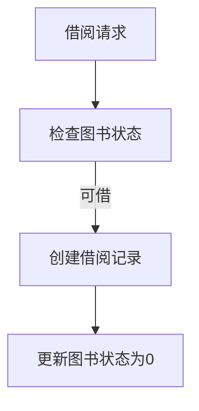

# 一、技术栈

- Spring Boot
- Spring Data JPA
- MySQL
- JWT

# 二、项目结构
```
d:\PROJECT\Java\Book_manage\library
├── src/main
│   ├── java/com/example/library
│   │   ├── controller/        # API控制器
│   │   │   ├── BookController.java       - 图书管理接口
│   │   │   ├── UserController.java       - 用户管理接口
│   │   │   └── BorrowRecordController.java - 借阅记录接口
│   │   ├── service/           # 业务逻辑
│   │   │   ├── BookService.java          - 图书业务处理
│   │   │   ├── UserService.java          - 用户认证与权限
│   │   │   └── BorrowRecordService.java  - 借阅流程控制
│   │   ├── repository/        # 数据持久层
│   │   │   ├── BookRepository.java       - 图书数据库操作
│   │   │   └── UserRepository.java       - 用户数据库查询
│   │   ├── entity/            # 数据实体
│   │   │   ├── Book.java                - 图书实体
│   │   │   ├── User.java                - 用户实体
│   │   │   └── BorrowRecord.java        - 借阅记录实体
│   │   └── response/          # 统一响应格式
│   │       └── Response.java            - 封装API响应结构
│   └── resources/
│       ├── application.properties      - Spring配置
│       └── db.sql                      - 数据库初始化脚本
```

# 三、功能模块

1. 图书管理模块
    - 功能实现：
        - 增删改查（ `BookController` ）
        - 多条件查询（标题/作者/分类）
        - 状态管理（1-可借阅 0-已借出）
    - 技术要点：
```java
// JPA动态查询示例
public List<Book> getBooksByTitleContaining(String title) {
    return bookRepository.findByTitleContaining(title);
}
```


2. 用户管理模块
- 功能实现：
    - JWT令牌认证（ `login` ）
    - 用户信息加密存储
    - 多条件组合查询
- 技术亮点：
```java
// UserController.java
@PostMapping("/login")

public Response<Map<String, Object>> login(@RequestBody User loginRequest) {

    // JWT令牌生成逻辑

    String token = Jwts.builder()

        .setSubject(username)

        .setExpiration(new Date(System.currentTimeMillis() + EXPIRATION_TIME))

        .signWith(SignatureAlgorithm.HS512, SECRET_KEY)

        .compact();

}
```

3. 借阅管理模块
- 核心流程:


- 关键技术：
```java
// BorrowRecordService.java

// 归还逻辑示例
public BorrowRecord returnBook(Integer id) {
    // 事务性操作
    book.setStatus(1);
    bookService.updateBook(book.getBookId(), book);
    return borrowRecordRepository.save(record);
}
```

# 四、架构设计
1. 分层架构 ：
    - Controller层：RESTful接口（ `BorrowRecordController.java` ）
    - Service层：业务逻辑封装
    - Repository层：数据持久化（ `BorrowRecordRepository` ）
2. 异常处理 ：统一响应格式:

```java
public class Response<T> {
    private Integer code;
    private String msg;
    private T data;
}
```